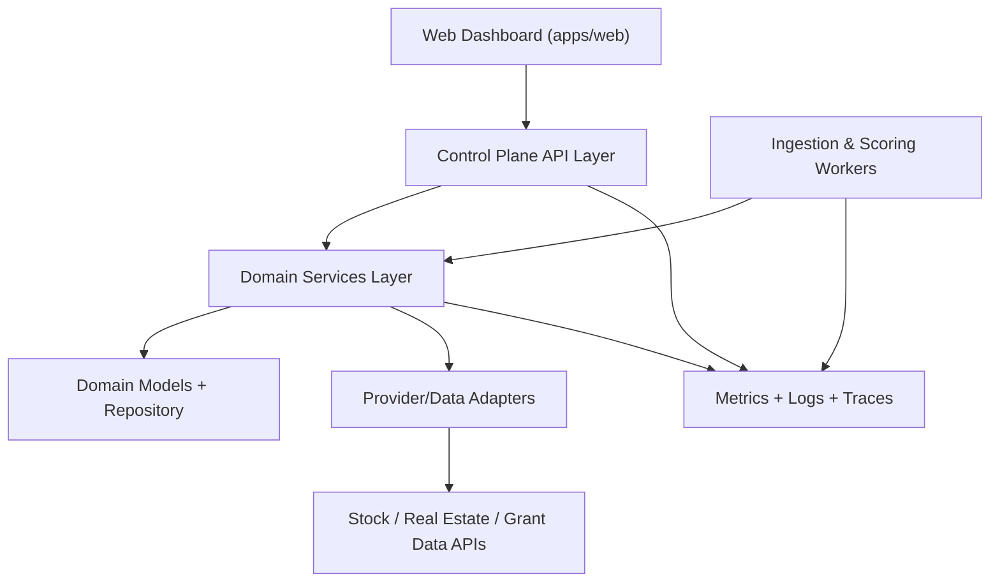

# System Architecture: OpportunityOS

## 1. System Overview

OpportunityOS is a modular control plane that ingests opportunities from heterogeneous providers, evaluates each opportunity through a configurable scoring policy, and exposes ranked opportunities and verification workflow through a dashboard API.

## 2. Service Map

| Service | Location | Responsibility | Owned By |
|---------|----------|---------------|----------|
| Control Plane API | `apps/control-plane/src/api` | Request validation, RBAC checks, endpoint orchestration | Backend |
| Opportunity Services | `apps/control-plane/src/services` | Ingestion, scoring, filtering, verification business logic | Backend |
| Provider Adapters | `apps/control-plane/src/adapters` | Provider-specific data fetch and normalization | Backend |
| Opportunity Models | `apps/control-plane/src/models` | Entity definitions, repositories, policy schemas | Backend |
| Background Workers | `apps/control-plane/src/workers` | Scheduled ingestion/scoring jobs and retries | Backend |
| Web Client | `apps/web/src` | Dashboard, filters, action queue, verification UX | Frontend |

## 3. Core Data Model Overview

| Entity | Description | Key Relationships |
|--------|-------------|------------------|
| Opportunity | Canonical normalized opportunity record | Belongs to ProviderSource, has one ScoreCard, has many VerificationEvents |
| ProviderSource | Data source metadata and connector configuration | Has many Opportunities |
| ScoreCard | Weighted evaluation breakdown and confidence | Belongs to Opportunity |
| FilterPreset | Saved filter criteria per operator/team | Applied to Opportunity query set |
| VerificationEvent | Human review state transitions (`pending`, `verified`, `rejected`) | Belongs to Opportunity, created by Operator |
| ActionItem | Follow-up task (P1) linked to opportunity | Belongs to Opportunity and Operator |

## 4. API Surface

| Endpoint Group | Service | Auth Required | Consumer |
|---------------|---------|---------------|----------|
| `/api/v1/ingestion/*` | Control Plane API | Yes (`operator`, `admin`) | Web Client / Worker |
| `/api/v1/opportunities/*` | Control Plane API | Yes (`viewer`, `operator`, `admin`) | Web Client |
| `/api/v1/verification/*` | Control Plane API | Yes (`operator`, `admin`) | Web Client |
| `/api/v1/watchlists/*` | Control Plane API | Yes (`operator`, `admin`) | Web Client |
| `/api/v1/dashboard/*` | Control Plane API | Yes (`viewer`, `operator`, `admin`) | Web Client |

## 5. External Dependencies

| Dependency | Purpose | Failure Mode | Fallback |
|-----------|---------|-------------|---------|
| Stock feed API | Market signal ingestion | Timeout/rate limit | Retry with backoff, stale-cache read |
| Real estate listing API | Property opportunity ingestion | Provider outage | Connector health degrade mode |
| Grants data API | Funding opportunity ingestion | Schema drift | Strict adapter schema mapping + dead letter queue |
| PostgreSQL | Durable store for opportunities and events | Unavailable | Read-only degraded mode from cache snapshot |
| Redis-compatible cache | Hot query cache and transient queues | Cache miss storm | Bypass cache with throttled DB reads |

## 6. Cross-Cutting Concerns

### Authentication & RBAC
- JWT/session token decoded in API layer.
- Roles: `viewer` (read only), `operator` (verify/update), `admin` (connector and policy administration).
- Service layer enforces role checks for mutating operations.

### Observability
- Every request/job carries `trace_id` and `request_id`.
- JSON logs with redaction middleware.
- Metrics for ingestion throughput, scoring latency, dashboard query latency, and verification conversion.

### Security
- Input validation at API boundaries and schema validation in adapters.
- PII and secrets redaction in logs/events.
- Secrets loaded only via central settings module and environment injection.

### Async / Queue Strategy
- Ingestion and rescoring run in worker loops.
- Worker retries are bounded with exponential backoff and dead-letter escalation.
- Stateless API nodes support horizontal scaling.

## 7. Environment Topology

| Environment | Purpose | Notes |
|-------------|---------|-------|
| `local` | Developer environment | In-memory repository fallback, optional docker services |
| `staging` | Integration and synthetic load testing | Mirrors production topology |
| `production` | Live operator usage | Multi-instance API + worker autoscaling |

## Architecture Notes vs PRD Reference

The PRD architecture is used as reference, but this architecture intentionally enforces stricter adapter boundaries and policy-driven scoring so new data sources and filter criteria can be introduced without rewriting service logic. This tradeoff increases upfront modularity while reducing long-term integration risk.

## Approval

- [x] System architecture reviewed and approved by autonomous `/run-agent`
- [x] Feature task stubs may be created in `ai/tasks/`
- [x] `qa.md` initialized with the feature list
